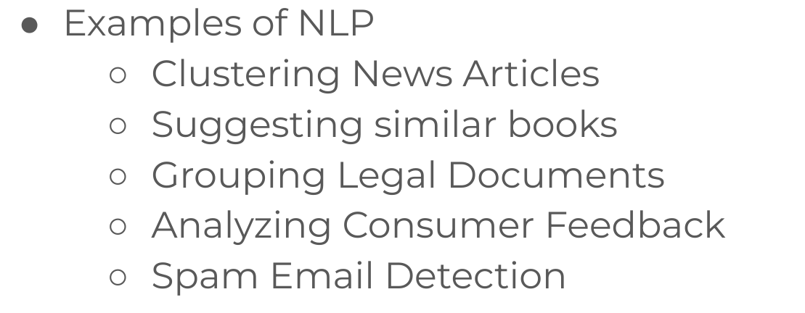
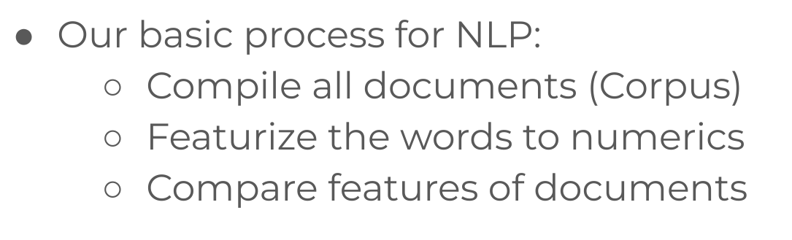
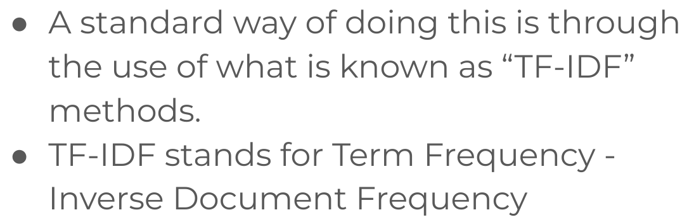
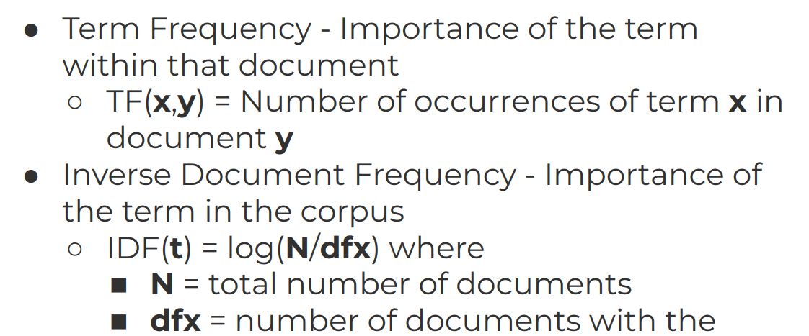
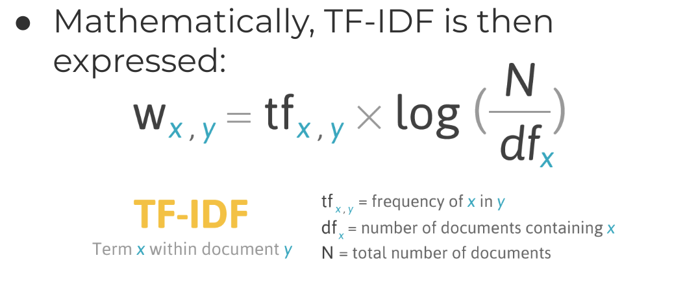

# 10-NLP
1. [Introduction to Natural Language Processing](#schema1)
2. [NLP Tools](#schema2)
3. [NLP Code ALong Project](#schema3)

## 1. Introduction to Natural Language Processing

## 2. NLP Tools

Tools_for_NLP.ipynb
- Tokenizer
Tokenizar en el procesamiento del lenguaje natural (NLP, por sus siglas en inglés) se refiere al proceso de 
dividir un texto en unidades más pequeñas llamadas "tokens". Un token puede ser tan corto como un carácter 
o tan largo como una palabra completa. En la mayoría de los casos, la tokenización implica dividir el texto en 
palabras individuales, pero también puede implicar dividir en frases o incluso en partes 
más pequeñas, como subpalabras o caracteres.

La tokenización es una etapa fundamental en el procesamiento del lenguaje natural porque ayuda a convertir el texto 
en una secuencia de elementos más manejables para su análisis. Los tokens son las unidades básicas con las que trabajan 
los modelos de procesamiento del lenguaje natural. Algunos ejemplos comunes de tokenización incluyen:

Tokenización de palabras: Dividir el texto en palabras individuales. Por ejemplo, la frase "Hola, ¿cómo estás?" 
se tokenizaría en los tokens: "Hola", ",", "¿cómo", "estás", "?".

Tokenización de frases: Dividir el texto en oraciones completas. Por ejemplo, la entrada "Este es un ejemplo. 
¿Y esto?" se tokenizaría en dos frases: "Este es un ejemplo." y "¿Y esto?".

Tokenización de subpalabras o caracteres: En algunos casos, especialmente en la tokenización de palabras en idiomas 
con caracteres no espaciados, como el chino, se pueden utilizar subpalabras o caracteres individuales como tokens.

La tokenización es una tarea importante en NLP porque proporciona la base para muchas otras tareas, 
como análisis de sentimientos, traducción automática, resumen de texto y muchas más. Las bibliotecas de procesamiento 
del lenguaje natural, como NLTK (Natural Language Toolkit) en Python, proporcionan funciones y herramientas para 
llevar a cabo la tokenización de manera eficiente.

- RegexTokenizer

RegexTokenizer es un tipo de tokenizador que utiliza expresiones regulares (regex) para dividir el texto en 
unidades más pequeñas llamadas "tokens". En el procesamiento del lenguaje natural (NLP), los tokenizadores 
son esenciales para dividir el texto en elementos más manejables para su posterior análisis. La elección de 
un tokenizador específico, como RegexTokenizer, puede depender de las necesidades específicas del análisis 
de texto que estés llevando a cabo.

- Stop words

En procesamiento del lenguaje natural (NLP), las "stop words" (palabras vacías o de parada) son palabras 
que se filtran antes o después del procesamiento de texto porque se considera que no aportan un valor 
significativo para el análisis. Estas palabras suelen ser comunes y aparecen con frecuencia en muchos documentos. 
Al eliminarlas, se pretende reducir la dimensionalidad del conjunto de datos y mejorar la eficiencia 
del procesamiento, al tiempo que se eliminan términos que no aportan mucha información semántica.

- N-grams

Los n-gramas son secuencias contiguas de n elementos (pueden ser caracteres, palabras o incluso otras unidades) 
extraídas de un texto o una secuencia de datos más amplia. Los n-gramas se utilizan comúnmente 
en el procesamiento del lenguaje natural (NLP) y en la minería de texto para capturar patrones 
y estructuras en el lenguaje.

Aquí hay algunos conceptos clave relacionados con los n-gramas:
- N-grams:
    - Unigrama (1-grama): Un unigrama es un n-grama de longitud 1, es decir, una sola palabra.

    - Bigrama (2-grama): Un bigrama es un n-grama de longitud 2, que consta de dos palabras consecutivas.

    - Trigrama (3-grama): Un trigrama es un n-grama de longitud 3, que consta de tres palabras consecutivas.

    - N-grama general (n-grama): Un n-grama general es una secuencia de n elementos (pueden ser palabras, caracteres, 
etc.).

## 3. NLP Code ALong Project